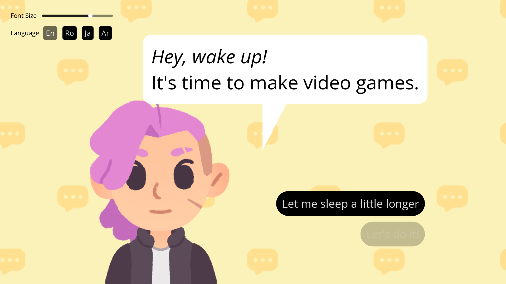
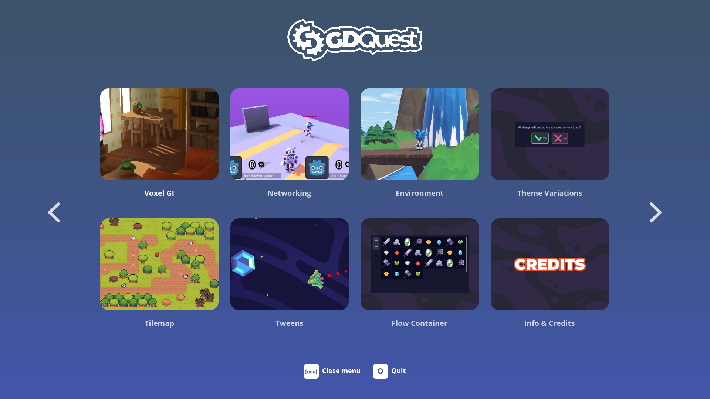
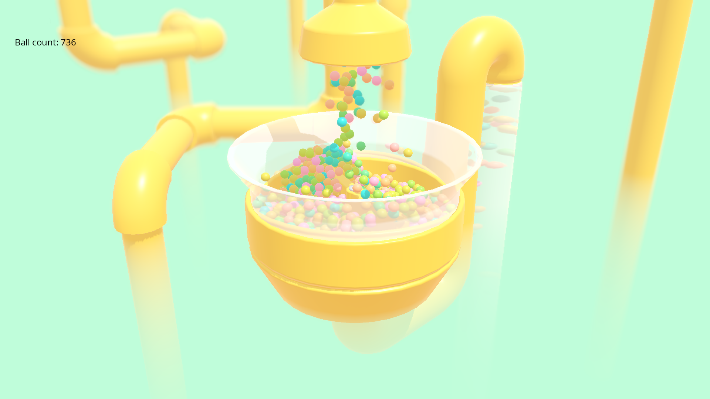
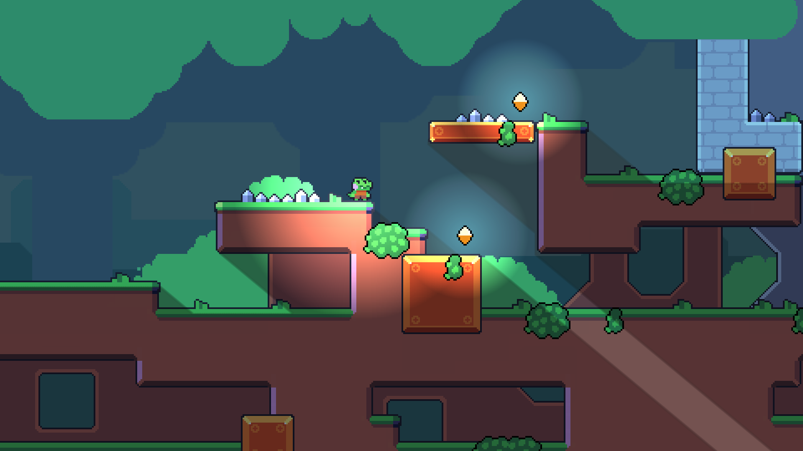
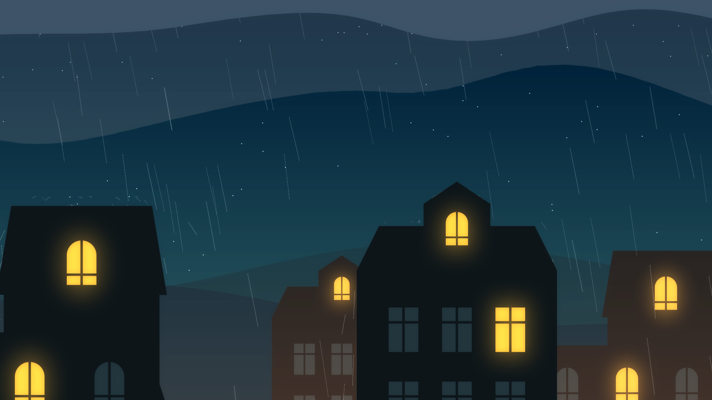
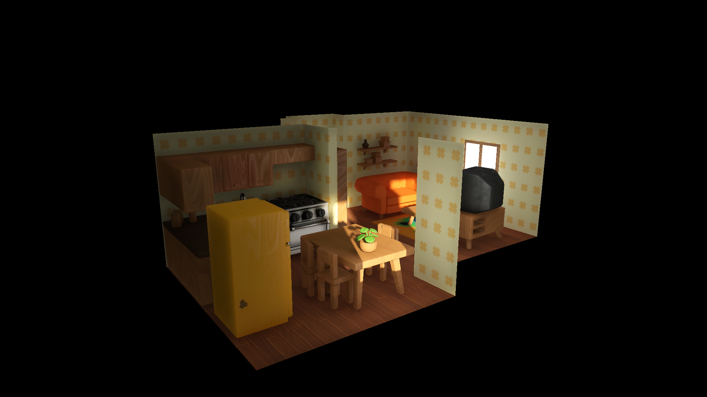
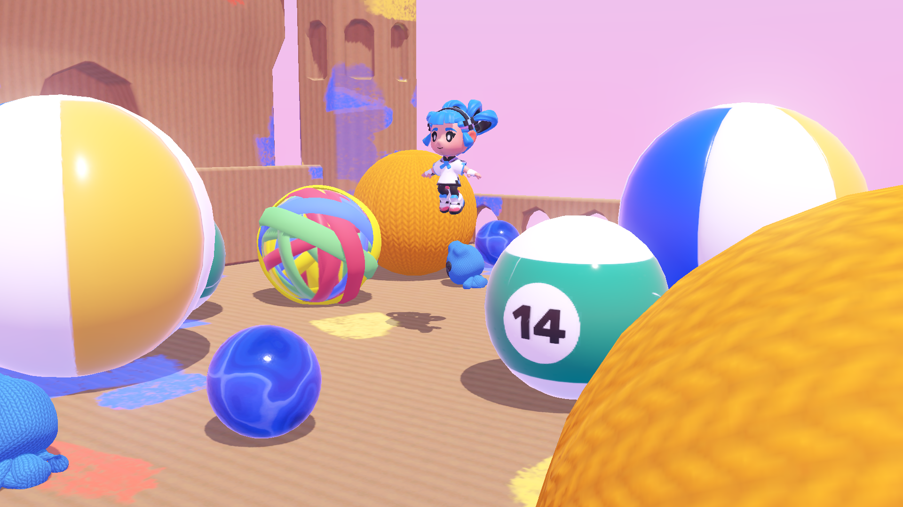

# Godot 4: New Features demos

In this project, we've built over of 20 simple demos you can play with and learn from to try some of Godot 4's new features.

Feel free to run the project and test them out!

We will keep this repository up to date with the latest Godot 4 releases.

To get the source code for previous Godot versions, click the links below:

- [Godot 4.0]()

## Demos

If you run the demo project, the navigation menu will provide you with a short description for each of these. If you prefer jumping to the code, here is the full list!

Godot 4.0:

- [2d Clipping](./2d_clipping)
- [2d Dynamic Lights](./2d_dynamic_lights)
- [2d Lighting](./2d_lighting_normal_map)
- [2d Particles](./2d_particles)
- [2d Physics Benchmark](./2d_physics_benchmark)
- [3d Animation Tree Audio](./3d_animation_tree_audio)
- [3d Balls Pool](./3d_balls_pool)
- [3d Particles](./3d_particles)
- [3d Physics Nodes](./3d_physics_nodes)
- [Animation Retargeting](./animation_retargeting)
- [Audio Polyphony](./audio_polyphony)
- [Cutout Character](./cutout_character)
- [Dialogue Tree](./dialogue_tree)
- [Heightmap Physics](./heightmap_physics)
- [Interface](./interface)
- [Interior](interior-./diorama)
- [Navigation](./navigation)
- [Networking](./networking)
- [Environment](./outdoor_environment)
- [Theme Variations](./theme_variations)
- [Tilemap](./tilemap)
- [Tweens](./tweens)
- [Flexbox](./ui_flexbox)

Godot 4.1:

- [Exported Node Array](./exported_node_array)
- [Particles Turbulence](./particles_turbulence)
- [Navigation Obstacles](./navigation) (navigation_obstacles.tscn)

## Bonus demos and code snippets

On top of the demos you can run from the menu, we have some examples accessible only in the editor.

- In [additional/custom_resources](additional/custom_resources), you'll find a demonstration of custom resource exports, grouped exports, auto-generation documentation, and generally, the new inspector panel and export features
- In [additional/POT_generation](additional/POT_generation), we explain how to generate POT (translation) files
- In [additional/snippets](additional/snippets), you'll find a good number of examples of the new GDScript features and syntax
- In [2d_particles](2d_particles), there's an additional rainy scene
- In [networking](networking), you'll find no less than six different network architectures, which we tried to keep as simple as possible, demonstrating different setups.

## Credits

We didn't build those demos alone; We were greatly helped by:

- Fales
- Paulloz
- Tokage
- iFire
- Smix8
- Calinou
- Raulsntos

## Controls

Most demos use:

- <kbd>W</kbd><kbd>A</kbd><kbd>S</kbd><kbd>D</kbd>
- <kbd>🖱 Mouse</kbd>
- <kbd>Left Mouse</kbd>
- <kbd>␣ Space</kbd>

Where relevant, we've described the controls.

